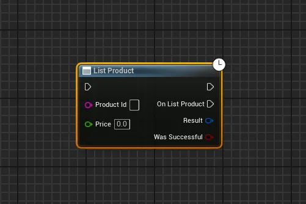

# SuiMarketplaceSDK Unreal Plugin Documentation

## Blueprint Nodes

### Login with Sui SDK


**Purpose**: Authenticates users with the Sui Unreal Plugin
**Inputs**:
- Username
- Password

**Outputs**:
- Auth Response: Authentication response data
- Was Successful: Boolean indicating login success/failure
- On Login: Event triggered when login attempt completes

### Get All Products


**Purpose**: Retrieves all available products from a collection
**Inputs**:
- Collection Id: Identifier for the target collection

**Outputs**:
- Products: Array of product data
- Was Successful: Boolean indicating operation success/failure
- On Get All Products: Event triggered when retrieval completes

### Get Owned Products


**Purpose**: Retrieves products owned by the authenticated user
**Inputs**:
- Collection Id: Identifier for the target collection

**Outputs**:
- Products: Array of owned product data
- Was Successful: Boolean indicating operation success/failure
- On Get Owned Products: Event triggered when retrieval completes

### Buy Product


**Purpose**: Initiates a purchase transaction for a specific product
**Inputs**:
- Product Id: Identifier for the product to purchase

**Outputs**:
- Result: Transaction result data
- Was Successful: Boolean indicating purchase success/failure
- On Buy Product: Event triggered when purchase attempt completes

### List Product


**Purpose**: Lists a product for sale
**Inputs**:
- Product Id: Identifier for the product to list
- Price: Numeric value representing the listing price

**Outputs**:
- Result: Listing operation result data
- Was Successful: Boolean indicating listing success/failure
- On List Product: Event triggered when listing completes

### Unlist Product


**Purpose**: Removes a product from being listed for sale
**Inputs**:
- Product Id: Identifier for the product to unlist

**Outputs**:
- Result: Unlisting operation result data
- Was Successful: Boolean indicating unlisting success/failure
- On Unlist Product: Event triggered when unlisting completes

## Usage Flow
1. Begin by authenticating the user using the "Login with Sui SDK" node
2. After successful authentication, you can:
   - Fetch available products using "Get All Products"
   - View user-owned products using "Get Owned Products"
   - Purchase products using "Buy Product"
   - List products for sale using "List Product"
   - Remove listings using "Unlist Product"

## Best Practices
1. Always check the "Was Successful" output before proceeding with subsequent operations
2. Handle authentication state appropriately throughout your application
3. Implement proper error handling for failed operations
4. Cache product data when appropriate to minimize blockchain queries
5. Verify ownership before attempting to list or unlist products

## Common Patterns
1. **User Authentication**:
   ```
   Login with Sui SDK -> Check Was Successful -> Proceed with operations
   ```

2. **Product Discovery**:
   ```
   Get All Products -> Filter/Display Products -> Enable Buy Function
   ```

3. **Marketplace Integration**:
   ```
   Get Owned Products -> List Product -> Monitor Was Successful
   ```

4. **Listing Management**:
   ```
   Get Owned Products -> List/Unlist Product -> Refresh Display
   ```
